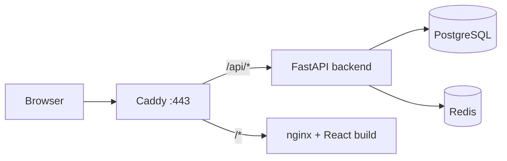

# 빈자리 (Binjari)

비어 있는 시간을 가장 확실하게 채우는 **실시간 예약·스케줄링 플랫폼**입니다.  
동시성 제어와 Redis 임시 선점으로 중복 예약을 방지하고, 호스트는 운영 규칙·슬롯·예외 일정을 설정해 예약 페이지를 운영합니다.

| 환경 | URL (예시) |
|------|------------|
| 운영 | https://www.binjari.shop |
| 포트폴리오 | https://portfolio.binjari.shop |

---

## 주요 기능

- **예약자**: 월 단위 캘린더 조회, 슬롯 선택·예약, 내 예약 조회·취소, WebSocket 실시간 알림
- **호스트**: 예약 페이지 생성·운영, 슬롯 일괄 생성, 예외 일정, 예약 승인/거절, 통계 대시보드
- **인증**: 이메일 가입/로그인, Google OAuth, JWT(Access) + HttpOnly Refresh Cookie
- **시스템**: PostgreSQL 트랜잭션 기반 예약 무결성, Redis Hold·Idempotency-Key, UTC 저장 + 호스트 타임존 정책

상세 요구사항은 [`docs/PRD.md`](docs/PRD.md), 화면 구조는 [`docs/IA.md`](docs/IA.md)를 참고하세요.

---

## 기술 스택

| 영역 | 기술 |
|------|------|
| Frontend | React 19, TypeScript, Vite, Tailwind CSS, React Router |
| Backend | Python 3.11, FastAPI, SQLModel, Alembic |
| Database | PostgreSQL 15 |
| Cache / Lock | Redis 7 |
| 운영 프록시 | Caddy 2 (자동 HTTPS) |
| 컨테이너 | Docker, Docker Compose |

---

## 프로젝트 구조

```text
binjari/
├── backend/           # FastAPI API 서버
├── frontend/        # React SPA (Vite)
├── docs/            # PRD, IA, ERD, 인증인가, 배포 가이드 등
├── Caddyfile        # 운영 리버스 프록시·HTTPS 설정
├── docker-compose.yml    # 로컬 개발용 Compose
└── compose.prod.yml      # 운영용 Compose (Caddy + nginx 정적 빌드)
```

---

## 빠른 시작 (로컬 개발)

### 사전 요구

- Docker & Docker Compose
- Git

### 1. 저장소 클론

```bash
git clone <repository-url>
cd binjari
```

### 2. 환경 변수 설정

프로젝트 루트에 `.env` 파일을 만듭니다. (Git에 커밋하지 마세요.)

```env
# --- DB (docker-compose.yml 변수 치환용) ---
DB_USER=binjari
DB_PASSWORD=your-local-password
DB_NAME=binjari

# --- 백엔드 (backend/app/core/config.py) ---
BINJARI_ENV=development
DATABASE_URL=postgresql+psycopg2://binjari:your-local-password@db:5432/binjari
REDIS_URL=redis://redis:6379/0
SECRET_KEY=dev-secret-change-in-production-min-32-chars!!

# --- 선택: Google OAuth ---
# GOOGLE_OAUTH_CLIENT_ID=
# GOOGLE_OAUTH_CLIENT_SECRET=
# GOOGLE_OAUTH_REDIRECT_URI=http://127.0.0.1:8000/api/v1/auth/google/callback
# FRONTEND_OAUTH_SUCCESS_URL=http://localhost:5173/

# --- 선택: CORS (쉼표 구분) ---
# CORS_ORIGINS=http://localhost:5173,http://127.0.0.1:5173
```

프론트엔드는 기본적으로 Vite가 `/api`를 백엔드로 프록시합니다. 별도 설정이 필요하면 [`frontend/.env.example`](frontend/.env.example)를 참고하세요.

### 3. 컨테이너 기동

```bash
docker compose up -d --build
```

| 서비스 | 주소 |
|--------|------|
| Frontend (Vite) | http://localhost:5173 |
| Backend API | http://localhost:8000 |
| Swagger UI | http://localhost:8000/docs |
| PostgreSQL | localhost:5432 |
| Redis | localhost:6379 |

백엔드 컨테이너는 기동 시 `alembic upgrade head`로 마이그레이션을 자동 적용합니다.

### 4. 동작 확인

```bash
docker compose ps
curl -sS -o /dev/null -w "%{http_code}\n" http://localhost:8000/docs
```

---

## 환경 변수 참고

### 루트 `.env` / `.env.prod` (Docker Compose)

| 변수 | 설명 | 비고 |
|------|------|------|
| `DB_USER` | PostgreSQL 사용자 | `compose.prod.yml`의 `${DB_*}` 치환에 사용 |
| `DB_PASSWORD` | PostgreSQL 비밀번호 | URL에 `!` 등 특수문자 있으면 인코딩 이슈 주의 |
| `DB_NAME` | PostgreSQL DB 이름 | |

> **운영 주의**: Compose는 YAML 안의 `${DB_USER}` 등을 **`env_file`이 아니라** 프로젝트 루트 `.env` 또는 `--env-file`로만 치환합니다. `.env.prod`만 있을 때는 아래처럼 실행하세요.
>
> ```bash
> docker compose --env-file .env.prod -f compose.prod.yml up -d --build
> ```

### 백엔드 (`backend/app/core/config.py`)

| 변수 | 기본값 | 설명 |
|------|--------|------|
| `BINJARI_ENV` | `development` | `production`이면 Refresh 쿠키에 `Secure` 적용 |
| `DATABASE_URL` | 로컬 PostgreSQL URL | asyncpg로 변환해 런타임 연결 |
| `REDIS_URL` | `redis://127.0.0.1:6379/0` | Hold·Idempotency·알림 등 |
| `SECRET_KEY` | (개발용) | JWT 서명 키, **운영에서 반드시 교체** |
| `ACCESS_TOKEN_EXPIRE_MINUTES` | `30` | Access Token TTL |
| `REFRESH_TOKEN_EXPIRE_DAYS` | `14` | Refresh Token TTL |
| `CORS_ORIGINS` | 개발·운영 Origin 목록 | 쉼표 구분 |
| `GOOGLE_OAUTH_CLIENT_ID` | — | 비우면 Google 로그인 비활성 |
| `GOOGLE_OAUTH_CLIENT_SECRET` | — | |
| `GOOGLE_OAUTH_REDIRECT_URI` | — | Google 콘솔 등록 콜백 URL |
| `FRONTEND_OAUTH_SUCCESS_URL` | `http://localhost:5173/` | OAuth 성공 후 리다이렉트 |
| `BINJARI_DEFAULT_ADMIN_EMAIL` | `admin@binjari.com` | 시드 관리자 이메일 |

### 프론트엔드 (`frontend/.env`)

| 변수 | 설명 |
|------|------|
| `VITE_API_BASE_URL` | 비우면 `/api` 프록시 사용 (로컬 권장) |
| `API_PROXY_TARGET` | Docker Compose 내 Vite → 백엔드 프록시 대상 |

---

## 운영 배포

운영은 **Caddy**가 80/443을 받고, `/api/*`는 백엔드, 나머지는 프론트엔드 정적 빌드로 프록시합니다. 도메인을 `Caddyfile`에 설정하면 Let's Encrypt 인증서가 자동 발급·갱신됩니다.

### EC2 보안 그룹

| 포트 | 용도 |
|------|------|
| 22 | SSH |
| 80 | HTTP (Caddy) |
| 443 | HTTPS |

### 배포 순서 (요약)

```bash
# 1. 서버에 클론 후 프로젝트 디렉터리로 이동
cd ~/binjari

# 2. .env.prod 준비 (DB_*, BINJARI_ENV=production, SECRET_KEY, OAuth 등)
ls -la .env.prod Caddyfile compose.prod.yml

# 3. 기동 (DB 변수 치환을 위해 --env-file 필수)
docker compose --env-file .env.prod -f compose.prod.yml up -d --build

# 4. 확인
docker compose --env-file .env.prod -f compose.prod.yml ps
docker compose --env-file .env.prod -f compose.prod.yml logs -f caddy
```

### HTTPS·도메인

1. DNS A 레코드를 EC2 공인 IP에 연결
2. [`Caddyfile`](Caddyfile)에서 도메인 블록 확인·수정
3. Caddy 재시작

```bash
docker compose --env-file .env.prod -f compose.prod.yml restart caddy
```

`BINJARI_ENV=production`이면 Refresh 쿠키에 `Secure`가 붙습니다. **HTTP(IP)만** 사용하면 로그인·세션이 정상 동작하지 않을 수 있으므로 HTTPS(도메인 + Caddy)를 사용하세요.

자세한 트러블슈팅은 [`docs/배포방법.md`](docs/배포방법.md)를 참고하세요.

---

## 아키텍처 (운영)



---

## API 문서

- **Swagger UI**: `/docs` (백엔드 기동 후)
- **OpenAPI 스펙**: [`docs/openapi.md`](docs/openapi.md)
- **에러 코드**: [`docs/API_ERRORS.md`](docs/API_ERRORS.md)
- **인증·인가**: [`docs/인증인가.md`](docs/인증인가.md)

---

## 문서 목록

| 문서 | 내용 |
|------|------|
| [`docs/PRD.md`](docs/PRD.md) | 제품 요구사항·비즈니스 정책 |
| [`docs/IA.md`](docs/IA.md) | 정보 구조·라우팅 |
| [`docs/ERD.md`](docs/ERD.md) | 데이터 모델 |
| [`docs/DDL.md`](docs/DDL.md) | DDL 참고 |
| [`docs/인증인가.md`](docs/인증인가.md) | JWT·OAuth·역할 권한 |
| [`docs/배포방법.md`](docs/배포방법.md) | EC2·Docker 운영 가이드 |
| [`docs/backend_DA.md`](docs/backend_DA.md) | 백엔드 디렉터리 구조 |
| [`docs/DESIGN_TOKENS.md`](docs/DESIGN_TOKENS.md) | UI 디자인 토큰 |

---

## 로컬 개발 (Docker 없이)

Docker 없이 실행할 때는 PostgreSQL·Redis를 별도로 띄운 뒤:

```bash
# Backend
cd backend
python -m venv .venv && source .venv/bin/activate  # Windows: .venv\Scripts\activate
pip install -r requirements.txt
alembic upgrade head
uvicorn app.main:app --reload --host 0.0.0.0 --port 8000

# Frontend (다른 터미널)
cd frontend
npm install
npm run dev
```

---

## 라이선스

이 저장소에 별도 라이선스 파일이 없습니다. 사용·배포 전 저장소 소유자의 라이선스 정책을 확인하세요.
